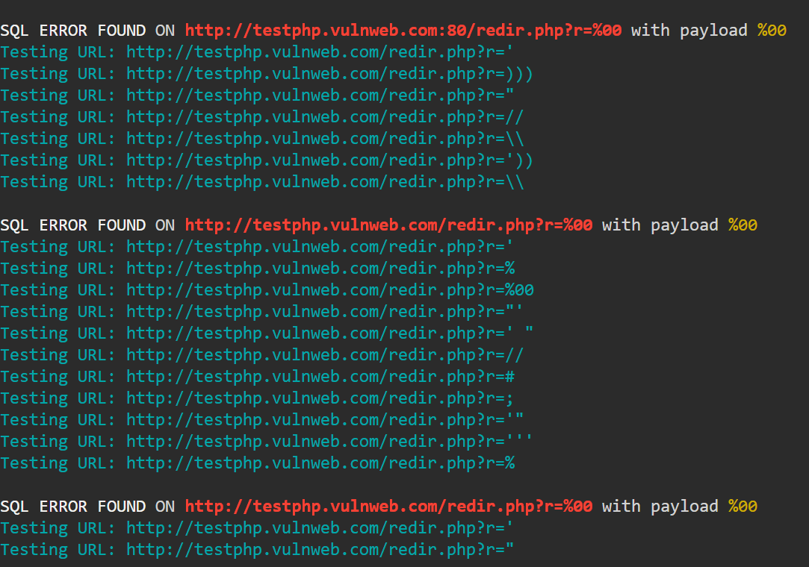

### Installation

```
cd /opt/ && sudo git clone https://github.com/freelancermijan/esqli.git && cd esqli/
sudo chmod +x ./esqli.py
cd
sudo ln -sf /opt/esqli/esqli.py /usr/local/bin/esqli
esqli -h
```

 <a href="https://github.com/freelancermijan/my-payloads/blob/main/SQLi/error-based-sqli-testing-payloads.txt">Error Based Payloads</a>



### Options

```
esqli -h                                                                                                                         ─╯
usage: esqli [-h] (-l LIST | -u URL) -p PAYLOADS [-s] [-t {1,2,3,4,5,6,7,8,9,10,11,12,13,14,15,16,17,18,19,20}] [-o OUTPUT]
                 [--parallel] [-V]

SQLi Error-Based Tool

options:
  -h, --help            show this help message and exit
  -l LIST, --list LIST  Provide a URLs list for testing
  -u URL, --url URL     Provide a single URL for testing
  -p PAYLOADS, --payloads PAYLOADS
                        Provide a list of SQLi payloads for testing
  -s, --silent          Rate limit to 12 requests per second
  -t {1,2,3,4,5,6,7,8,9,10,11,12,13,14,15,16,17,18,19,20}, --threads {1,2,3,4,5,6,7,8,9,10,11,12,13,14,15,16,17,18,19,20}
                        Number of threads (1-20)
  -o OUTPUT, --output OUTPUT
                        File to save only positive results
  --parallel            Enable parallel mode for parameter scanning
  -V, --version         Display version information and exit
```

### Usage

```
esqli -l vulnweb.com.parameters.txt -p payloads/error.txt -t 10 --parallel -o saved.txt
```
