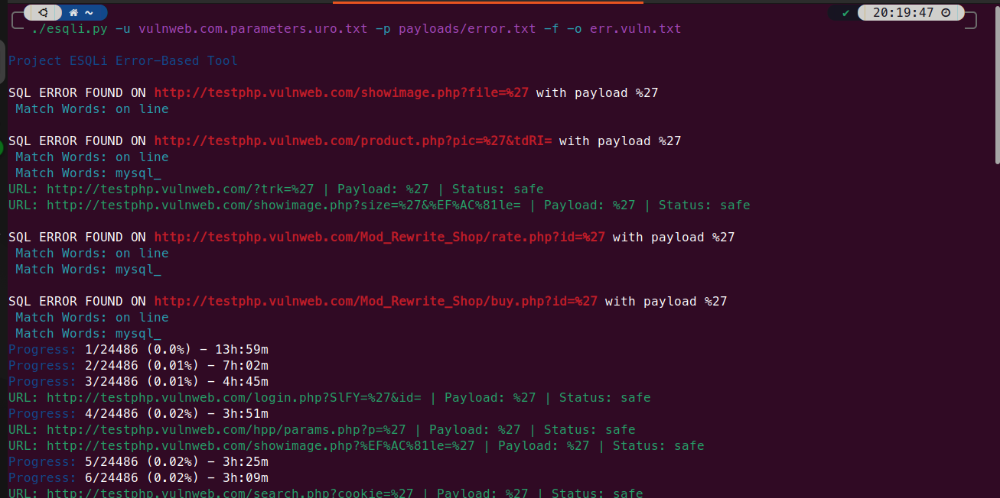

### Installation

```
cd /opt/ && sudo git clone https://github.com/freelancermijan/esqli.git && cd esqli/
sudo chmod +x ./esqli.py
cd
sudo ln -sf /opt/esqli/esqli.py /usr/local/bin/esqli
esqli -h
```

 <a href="https://github.com/freelancermijan/my-payloads/blob/main/SQLi/error-based-sqli-testing-payloads.txt">Error Based Payloads</a>



### Options

```
usage: esqli [-h] -u URLS -p PAYLOADS [-s] [-f] [-o OUTPUT] [-V]

SQLi Error-Based Tool

options:
  -h, --help            show this help message and exit
  -u URLS, --urls URLS  Provide a URLs list for testing
  -p PAYLOADS, --payloads PAYLOADS
                        Provide a list of SQLi payloads for testing
  -s, --silent          Rate limit to 12 requests per second
  -f, --fast            Use multi-threading for faster scanning
  -o OUTPUT, --output OUTPUT
                        File to save only positive results
  -V, --version         Display version information and exit
```
